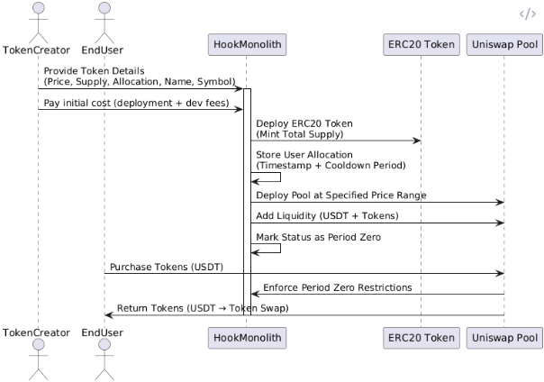
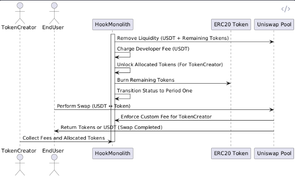
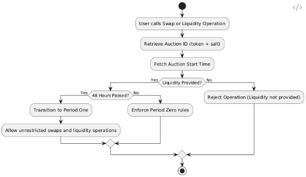

### **Core Components**

1. **ERC20 Token Contract**:
    
    - Standard ERC20 implementation with:
        - `totalSupply`
        - `allocatedAmount` (locked for the creator during the auction)
        - `name`, `symbol` (18 decimals by default)
    - Provides the total supply minus allocated tokens to the HookMonolith.
    - Locked tokens are unlocked after **Period Zero** ends.
2. **HookMonolith Contract**:
    
    - **Responsibilities**:
        
        - Deploy ERC20 token and manage allocations.
        - Deploy and initialize Uniswap v4 pool at a user-defined price range.
        - Control auction phases with `beforeSwapHook`, `afterSwapHook`, and liquidity hooks.
    - **Auction Lifecycle**:
        
        - **Period Zero** (First 48 hours):
            - Only USDT → Token swaps are allowed.
            - Liquidity addition and removal are blocked.
        - **Transition to Period One**:
            - Remove liquidity, deduct developer fees in USDT, and unlock allocated tokens for the creator.
            - Burn remaining tokens in the pool.
        - **Period One**:
            - Free market operations with custom fees benefiting the creator.
3. **Uniswap v4 Pool**:
    
    - Serves as the liquidity pool for the token.
    - Deployed and initialized by HookMonolith with the user-defined price range.


### State Management
#### **State Variables**

```solidity
// Auction Configuration
mapping(bytes32 => uint256) public auctionStartTimestamps; // Mapping to store auction creation timestamps
uint256 public cooldownPeriod = 48 hours; // Cooldown duration before Period One
```

#### **Helper Functions**

1. **Generate Auction ID**:
    - This generates a unique ID for each auction using the token address and a salt provided during auction creation.

```solidity
function generateAuctionID(address token, uint256 salt) internal pure returns (bytes32) {
    return keccak256(abi.encodePacked(token, salt));
}
```

2. **Retrieve Auction Start Time**:
    - Get the stored timestamp for a specific auction ID.

```solidity
function getAuctionStartTime(address token, uint256 salt) internal view returns (uint256) {
    bytes32 auctionID = generateAuctionID(token, salt);
    return auctionStartTimestamps[auctionID];
}
```

3. **Set Auction Start Time**:
    - Store the auction creation timestamp when initializing the auction.

```solidity
function setAuctionStartTime(address token, uint256 salt) internal {
    bytes32 auctionID = generateAuctionID(token, salt);
    require(auctionStartTimestamps[auctionID] == 0, "Auction already exists");
    auctionStartTimestamps[auctionID] = block.timestamp;
}
```

### **Period Enforcement Logic**

#### **Dynamic Period Check**

```solidity
function getCurrentPeriod(address token, uint256 salt) public view returns (uint8) {
    uint256 auctionStartTime = getAuctionStartTime(token, salt);
    require(auctionStartTime > 0, "Auction does not exist");

    if (block.timestamp < auctionStartTime + cooldownPeriod) {
        return 0; // Period Zero
    } else {
        return 1; // Period One
    }
}
```

#### **Control Flow Modifier**

```solidity
modifier enforcePeriod(address token, uint256 salt) {
    uint8 currentPeriod = getCurrentPeriod(token, salt);

    if (currentPeriod == 0) {
        require(hasProvidedLiquidity(token, salt), "Liquidity not yet provided");
    }
    _;
}
```

#### **Liquidity Check**

- Check if liquidity has been provided before transitioning to **Period Zero**.

```solidity
function hasProvidedLiquidity(address token, uint256 salt) internal view returns (bool) {
    // Replace with logic to confirm liquidity provision
    return /* check liquidity */;
}
```

### **Hook Integration**

#### **beforeSwapHook**

```solidity
function beforeSwapHook(address token, uint256 salt, ...) external enforcePeriod(token, salt) {
    uint8 currentPeriod = getCurrentPeriod(token, salt);

    if (currentPeriod == 0) {
        require(isUSDTToTokenSwap(), "Only USDT -> Token swaps allowed in Period Zero");
    }
    // Allow unrestricted swaps in Period One
}
```

#### **Liquidity Hooks**

```solidity
function beforeAddLiquidity(address token, uint256 salt, ...) external enforcePeriod(token, salt) {
    uint8 currentPeriod = getCurrentPeriod(token, salt);
    require(currentPeriod == 1, "Liquidity operations not allowed in Period Zero");
}

function beforeRemoveLiquidity(address token, uint256 salt, ...) external enforcePeriod(token, salt) {
    uint8 currentPeriod = getCurrentPeriod(token, salt);
    require(currentPeriod == 1, "Liquidity operations not allowed in Period Zero");
}
```

---

### **Auction Initialization**

When creating a new auction, you will:

1. Generate an auction ID using the token address and salt.
2. Store the creation timestamp in the `auctionStartTimestamps` mapping.

Example:

```solidity
function initializeAuction(address token, uint256 salt, ...) external {
    // Set auction start time
    setAuctionStartTime(token, salt);

    // Deploy pool, provide liquidity, and perform other setup operations
    deployPool(token, ...);
    provideLiquidity(token, ...);
}
```

---


### Diagrams for Reference




