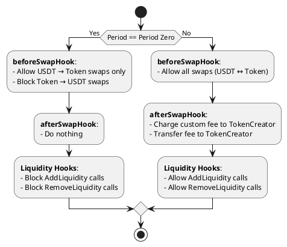
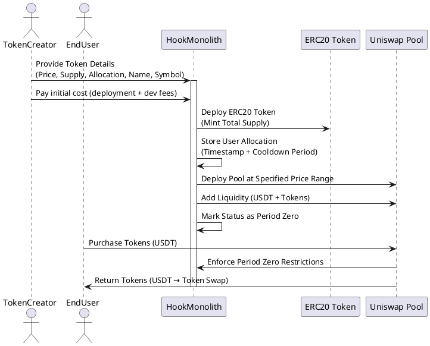
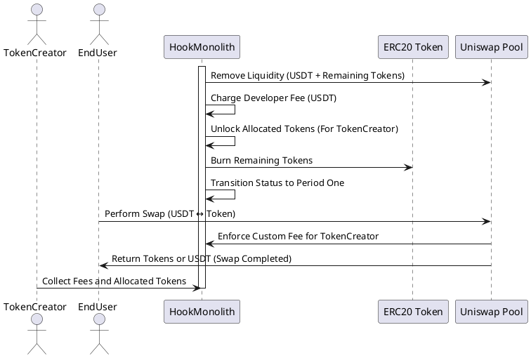
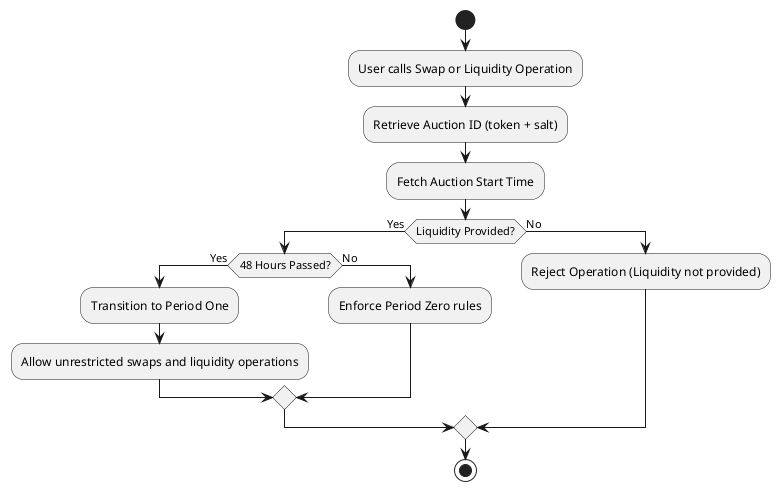

All diagrams were built in plantUML and can be reproduced with the following snippets:

#### Hooks during each period

```plantuml
@startuml "Hook Control Flow Across Periods"
start

if (Period == Period Zero) then (Yes)
    :**beforeSwapHook**:
    - Allow USDT → Token swaps only
    - Block Token → USDT swaps;
    :**afterSwapHook**:
    - Do nothing;
    :**Liquidity Hooks**:
    - Block AddLiquidity calls
    - Block RemoveLiquidity calls;
else (No)
    :**beforeSwapHook**:
    - Allow all swaps (USDT ↔ Token);
    :**afterSwapHook**:
    - Charge custom fee to TokenCreator
    - Transfer fee to TokenCreator;
    :**Liquidity Hooks**:
    - Allow AddLiquidity calls
    - Allow RemoveLiquidity calls;
endif

stop
@enduml
```

#### Period zero

```plantuml
@startuml "Period Zero"
actor TokenCreator
actor EndUser
participant HookMonolith
participant "ERC20 Token" as Token
participant "Uniswap Pool" as Pool

TokenCreator -> HookMonolith: Provide Token Details\n(Price, Supply, Allocation, Name, Symbol)
activate HookMonolith

TokenCreator -> HookMonolith: Pay initial cost (deployment + dev fees)

HookMonolith -> Token: Deploy ERC20 Token\n(Mint Total Supply)
HookMonolith -> HookMonolith: Store User Allocation\n(Timestamp + Cooldown Period)
HookMonolith -> Pool: Deploy Pool at Specified Price Range
HookMonolith -> Pool: Add Liquidity (USDT + Tokens)
HookMonolith -> HookMonolith: Mark Status as Period Zero

EndUser -> Pool: Purchase Tokens (USDT)
Pool -> HookMonolith: Enforce Period Zero Restrictions
Pool -> EndUser: Return Tokens (USDT → Token Swap)

deactivate HookMonolith
@enduml
```

#### Period one

```plantuml
@startuml "Period One"
actor TokenCreator
actor EndUser
participant HookMonolith
participant "ERC20 Token" as Token
participant "Uniswap Pool" as Pool

activate HookMonolith

HookMonolith -> Pool: Remove Liquidity (USDT + Remaining Tokens)
HookMonolith -> HookMonolith: Charge Developer Fee (USDT)
HookMonolith -> HookMonolith: Unlock Allocated Tokens (For TokenCreator)
HookMonolith -> Token: Burn Remaining Tokens
HookMonolith -> HookMonolith: Transition Status to Period One

EndUser -> Pool: Perform Swap (USDT ↔ Token)
Pool -> HookMonolith: Enforce Custom Fee for TokenCreator
Pool -> EndUser: Return Tokens or USDT (Swap Completed)

TokenCreator -> HookMonolith: Collect Fees and Allocated Tokens

deactivate HookMonolith
@enduml
```

#### Auction period enforcement

```plantuml
@startuml "Auction Period Enforcement"
start

:User calls Swap or Liquidity Operation;
:Retrieve Auction ID (token + salt);
:Fetch Auction Start Time;

if (Liquidity Provided?) then (Yes)
    if (48 Hours Passed?) then (Yes)
        :Transition to Period One;
        :Allow unrestricted swaps and liquidity operations;
    else (No)
        :Enforce Period Zero rules;
    endif
else (No)
    :Reject Operation (Liquidity not provided);
endif

stop
@enduml
```