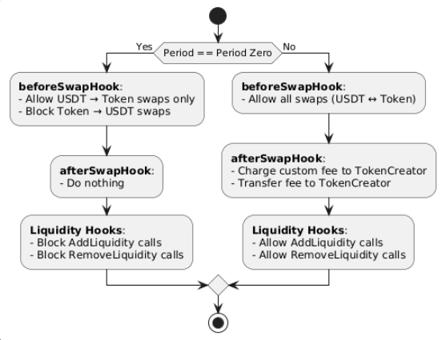

### **Hook Functionality**

#### 1. **beforeSwapHook**

- **Period Zero**:
    - Allow only USDT → Token swaps.
    - Block Token → USDT swaps.
- **Period One**:
    - Allow all swaps (USDT ↔ Token).

#### 2. **afterSwapHook**

- **Period Zero**:
    - No post-swap actions.
- **Period One**:
    - Charge a custom fee on swaps.
    - Transfer the fee to the token creator.

#### 3. **Liquidity Hooks** (beforeAddLiquidity, beforeRemoveLiquidity)

- **Period Zero**:
    - Block all liquidity addition and removal operations.
- **Period One**:
    - Allow both adding and removing liquidity.

### Diagram

